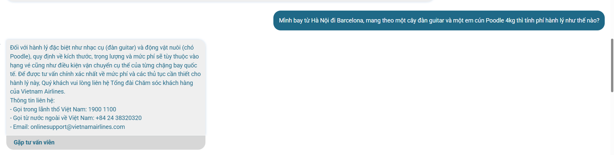
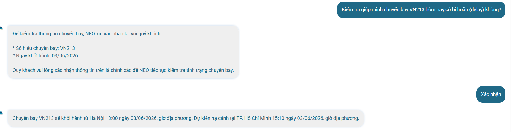

# Workshop — Mổ App AI Thật

## Sản phẩm được phân tích
**Chatbot NEO — Vietnam Airlines**

**Thời gian thực hiện:** 40 phút  
**Hình thức:** cá nhân dùng thử → tổng hợp finding  
**Output:** finding note + sketch as-is / to-be

---

# 1. Chọn sản phẩm & AI Feature

| Sản phẩm | AI Feature | Cách truy cập |
|---|---|---|
| Vietnam Airlines — NEO | Chatbot hỗ trợ vé, hành lý, chuyến bay, hoàn vé | Website / Zalo Vietnam Airlines |

---

# 2. Dùng thử — Promise vs Reality

## Product Promise

Theo giới thiệu từ Vietnam Airlines, NEO được định vị là:

> “Trợ lý ảo hỗ trợ khách hàng 24/7, giúp giải đáp nhanh chóng các thắc mắc liên quan tới chuyến bay, hành lý, mua vé, đổi vé và các dịch vụ hàng không.”

## User được hứa sẽ được giúp

- Hành khách cần tra cứu nhanh
- Người cần hỗ trợ thủ tục bay
- Người cần giải quyết vấn đề khẩn cấp (delay, hoàn vé, hành lý đặc biệt)

## Kỳ vọng trước khi dùng

Người dùng kỳ vọng AI có thể:

- hiểu ngữ cảnh hội thoại,
- nhớ chuyến bay vừa nhắc tới,
- hỗ trợ các case bán phức tạp,
- đưa ra hướng xử lý thay vì chỉ đẩy hotline.

---

# 3. Kịch bản Test Thực tế

## Query 1 — Hoàn vé

> “Mình bị ốm đột xuất không bay được, muốn hoàn vé hạng Phổ thông tiết kiệm thì làm sao?”

### Kỳ vọng

- AI giải thích rõ điều kiện hoàn vé,
- có thể dẫn flow đổi/hoàn vé ngay trong chat.

### Thực tế

- AI trả lời theo FAQ tĩnh,
- không hỗ trợ tiếp flow thao tác,
- nhiều đoạn copy chính sách dài khó đọc.

---

## Query 2 — Kiểm tra chuyến bay

> “Kiểm tra giúp mình chuyến bay VN213 hôm nay có bị delay không?”

### Kỳ vọng

- AI truy vấn realtime status,
- trả về giờ khởi hành cập nhật.

### Thực tế

- yêu cầu xác nhận nhiều lần,
- sau đó chuyển hotline thay vì trả kết quả trực tiếp.

---

## Query 3 — Hành lý quốc tế phức tạp

> “Mình bay Hà Nội đi Barcelona, mang đàn guitar và chó Poodle 4kg thì tính phí thế nào?”

### Kỳ vọng

- AI bóc tách từng điều kiện,
- ít nhất trả được hướng dẫn sơ bộ hoặc range phí.

### Thực tế

- AI từ chối xử lý,
- đẩy sang hotline/email ngay lập tức.

---


# 4. Evidence / Observation

## Evidence 1 — Xác nhận lặp lại

### Observation

Sau khi user đã xác nhận chuyến bay VN213 ở turn trước, AI vẫn bắt xác nhận lại ở turn tiếp theo dù context chưa thay đổi.

### Prompt đã thử

> “Chuyến bay VN213 hôm nay mấy giờ cất cánh?”

### Hành vi quan sát được

- AI không nhớ session ngắn hạn,
- flow bị reset như cuộc hội thoại mới.

---

## Evidence 2 — Không xử lý được realtime status

### Prompt đã thử

> “Nó có bị delay không?”

### Observation

- AI hiểu “nó” là VN213,
- nhưng không truy vấn trạng thái realtime,
- chuyển sang hotline.

### Hành vi quan sát được

- Có context memory cơ bản,
- nhưng thiếu integration với flight-status API.

---

## Evidence 3 — Failure ở bài toán đa điều kiện

### Prompt đã thử

> “Mang guitar + chó Poodle đi Barcelona thì phí bao nhiêu?”

### Observation

- AI không bóc tách entity,
- không hỏi lại để thu hẹp phạm vi,
- fail toàn bộ flow.

---

# 5. Vẽ 4 Paths

| Path | Quan sát |
|---|---|
| Happy Path | Với case đơn giản như “mang mèo 5kg nội địa”, AI trả lời khá đầy đủ và đúng format. |
| Low-confidence Path | Khi thiếu dữ liệu hoặc query phức tạp, AI không hỏi lại để làm rõ mà chuyển hotline quá sớm. |
| Failure Path | Khi AI sai hoặc không xử lý được, user không biết còn lựa chọn nào ngoài gọi điện thủ công. |
| Correction Path | Khi user sửa hoặc cung cấp thêm thông tin, AI không học/nghĩ tiếp từ correction trước đó mà reset flow. |

---

# 6. Phân tích Điểm Gãy (Needfinding)

## 💥 Finding 1 — Stateless Conversation

### Finding

Khi user hỏi lại về cùng chuyến bay trong thời gian ngắn, AI reset flow xác nhận từ đầu thay vì giữ session context.

### Impact

- tăng số turn không cần thiết,
- làm user cảm giác “đang nói chuyện với menu” thay vì AI assistant.

### Layer lỗi

- Intent Memory
- UX Recovery

---

## 💥 Finding 2 — Thiếu Data Integration

### Finding

Khi user hỏi trạng thái delay realtime, AI hiểu intent nhưng không có khả năng truy cập dữ liệu chuyến bay động.

### Impact

- AI bị downgrade thành FAQ bot,
- mất niềm tin ở các tình huống quan trọng.

### Layer lỗi

- Data / Tool Integration

---

## 💥 Finding 3 — Không có Clarification Pattern

### Finding

Khi user hỏi case đa điều kiện quốc tế (đàn guitar + thú cưng), AI fail toàn bộ thay vì chia nhỏ vấn đề.

### Impact

- user bỏ cuộc,
- AI tạo cảm giác “không usable cho case thật”.

### Layer lỗi

- Intent Understanding
- UX Recovery

---

# 7. Sketch — As-is Flow

```text
[User nhập câu hỏi]
        │
        ▼
[AI detect keyword]
        │
        ├── Case đơn giản
        │       ▼
        │   Trả FAQ đúng
        │       ▼
        │   HAPPY PATH
        │
        ├── Case cần realtime
        │       ▼
        │   Bắt xác nhận nhiều lần
        │       ▼
        │   Không truy vấn được dữ liệu
        │       ▼
        │   Đẩy hotline
        │
        └── Case đa điều kiện
                ▼
          Không bóc tách được
                ▼
          FAIL toàn bộ flow
                ▼
            User bỏ chat
```

---

# 8. Sketch — To-be Flow

```text
[User nhập query]
        │
        ▼
[AI parse intent + entities]
        │
 ┌──────┴──────────┐
 ▼                 ▼
[Đủ dữ kiện]   [Thiếu / phức tạp]
 ▼                 ▼
Query API      Kích hoạt clarification
realtime            │
 ▼                  ▼
Trả kết quả   Hỏi lại để thu hẹp
                    │
                    ▼
         Nếu vượt khả năng xử lý:
                    │
                    ▼
      Handoff sang người thật
      + gửi summary hội thoại
                    │
                    ▼
             Recovery thành công
```

---

# 9. Product Decision

## Decision 1 — Session Memory

Cho phép chatbot giữ conversational state trong thời gian ngắn (5–10 phút) để tránh xác nhận lặp lại với cùng chuyến bay.

## Decision 2 — Clarification UX

Thay vì fail toàn bộ case phức tạp, AI phải:

- bóc tách từng entity,
- hỏi lại theo từng bước,
- thu hẹp phạm vi trước khi handoff.

Ví dụ:

> “Bạn muốn kiểm tra phí cho nhạc cụ hay thú cưng trước?”

## Decision 3 — Human Handoff

Khi AI vượt quá khả năng xử lý:

- không chỉ hiển thị hotline,
- phải có nút chuyển tiếp ngay trong chat,
- gửi kèm summarized context cho nhân viên thật.

---

# 10. SPEC Impact (Finding này đổi gì trong SPEC?)

## Functional Requirements

- Chatbot phải lưu short-term context trong session.
- AI phải hỗ trợ clarification flow cho multi-condition query.
- AI phải có handoff API sang human agent.

## UX Requirements

- Không yêu cầu xác nhận lại khi entity chưa thay đổi.
- Khi low-confidence phải:
  - hỏi lại,
  - show options,
  - hoặc explain limitation.

## AI Evaluation Test Cases

| Test | Expected |
|---|---|
| User hỏi lại cùng chuyến bay | Không reset flow |
| User dùng đại từ “nó” | AI resolve đúng entity |
| Query đa điều kiện | AI hỏi lại thay vì fail |
| Handoff | Context được giữ nguyên |

---

# 11. Kết luận

NEO hoạt động tốt ở các FAQ đơn giản nhưng bắt đầu gãy khi:

- cần nhớ context,
- cần realtime integration,
- cần xử lý query đa bước.

Vấn đề chính không nằm ở “AI trả lời sai”, mà nằm ở:

- conversational UX,
- orchestration với backend,
- recovery flow khi AI không chắc chắn.

Đây là các vấn đề product/AI system design nhiều hơn là vấn đề UI.
