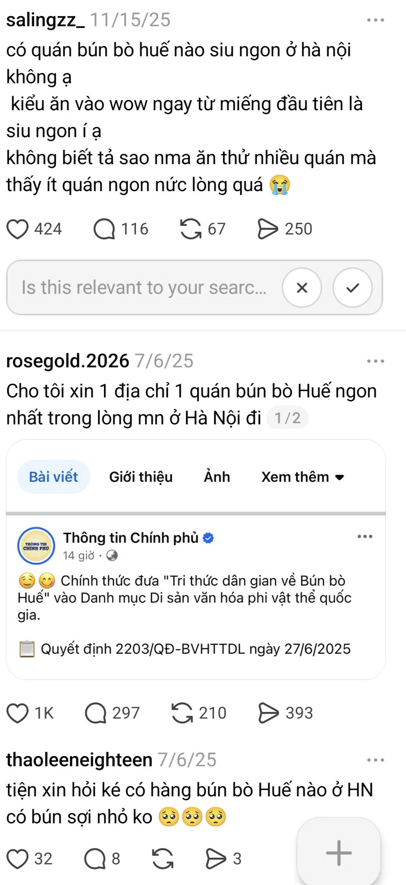

# Thin SPEC Cuối Day 05 — Chat món → quán + LLM orchestrator (`be/`)

Thin SPEC không phải PRD đầy đủ. Đây là bản cam kết đủ rõ để sáng Day 06 nhóm build ngay.

> **Chú thích:** `*...*` = nhóm tự điền thật trước nộp.

## 1. Track, product/app và user

**Track:** Food / Super-app  
**Product/app thật:** GrabFood *(tham chiếu UX/evidence; API đặt hàng thật không nằm trong slice)*  
**User cụ thể:** Người 22–40, dùng app đặt ăn **≥ 2 lần/tuần**; biết cảm giác/nhu cầu bữa (healthy, nhẹ, rẻ, nhóm, gần…) nhưng khó map sang món + quán cụ thể.  
**Nhóm có phải user thật không? Nếu không, khác ở đâu?** *\[Có / Một phần — mô tả: vd. nhóm đặt Grab 3–5 lần/tuần nhưng demo dùng catalog mock HCM\]*

## 2. Evidence summary

| Evidence | Nguồn | User/pain nói lên điều gì? | SPEC phải đổi gì? |
|---|---|---|---|
| "Không biết ăn gì" | *\[https://www.threads.com/@_nhwqynf/post/DZHo21vAX1a, https://www.threads.com/@lucif.th/post/DXZSBkVkTCB\]* | Paralysis | Orchestrator + clarify |
| Có món trong đầu, chưa chọn quán |  | Quán là bước 2 | `suggest_restaurants(dish_id)` |
| "Gần X" là một phần câu | *\[https://www.threads.com/@riwhiunyyyy/post/DWQPEiDEYlV\]* | Không bắt buộc GPS | `resolve_location` conditional |
| Chatbot chung hay hallucination | Competitor / analog | Cần catalog + tool | `be/data/*.json` + handlers |

## 3. Pain statement

> User người đặt đồ ăn qua app thường xuyên đang gặp khó khi chuyển từ
> "ngữ cảnh bữa ăn tôi muốn" (mood, budget, dietary, số người, gần hay không…)
> sang "món cụ thể và quán có món đó",
>
> vì app chủ yếu search keyword/filter rời rạc và gợi ý theo lịch sử đơn cũ
> (repeat order — [Grab tech blog, 2022](https://www.grab.com/inside-grab/stories/personalising-food-recommendations-on-grabfood)),
> không có orchestrator hiểu intent và không gợi ý theo thứ tự món → quán,
>
> dẫn tới lướt trung bình 17 phút chưa đặt và 74% vào app không biết ăn gì
> ([Grab internal data, 2022](https://www.grab.com/inside-grab/stories/personalising-food-recommendations-on-grabfood)),
> gợi ý lệch mood/dietary
> ([Kenh14 user review, 04/2026](https://kenh14.vn/phat-hien-cua-nguoi-luoi-khi-song-tren-app-be-shopee-grab-moi-app-1-nhiem-vu-toi-van-an-ngon-di-tien-ma-chang-ton-may-215260418095218817.chn)),
> hoặc chọn quán không có món phù hợp.
>
> *Bằng chứng: [Grab tech blog (2022)](https://www.grab.com/inside-grab/stories/personalising-food-recommendations-on-grabfood) + [Kenh14 user review (04/2026)](https://kenh14.vn/phat-hien-cua-nguoi-luoi-khi-song-tren-app-be-shopee-grab-moi-app-1-nhiem-vu-toi-van-an-ngon-di-tien-ma-chang-ton-may-215260418095218817.chn) + ngày phỏng vấn \*/\*/2026*

## 4. Build slice

```text
Cho người dùng app đặt đồ ăn mô tả ngữ cảnh tìm kiếm bằng ngôn ngữ tự nhiên,

prototype FastAPI (be/) sẽ dùng LLM orchestrator (agents/orchestrator.py) để
  (1) trích xuất ngữ cảnh và chọn tool_plan phù hợp,
  (2) augment gợi ý 2 món (food_agent + tools/handlers/food_search.py),
  (3) sau khi user chọn món — augment gợi ý 2 quán có món đó
      (restaurant_agent; tools/handlers/places.py nếu intent_nearby),

tạo ra (qua POST /api/chat SSE):
  event context (slots + tool_plan),
  event dishes (2 món + lý do),
  event restaurants (2 quán + lý do),

và xử lý thiếu ngữ cảnh / parse sai dietary / quán không có món
bằng clarify_context, user xác nhận context, correction, disclaimer, không auto-order.
```

## 5. Auto/Aug decision

Chọn một:

- [x] **Augmentation:** AI gợi ý/draft/phân loại, user quyết cuối.
- [ ] **Conditional automation:** AI tự làm trong case hẹp; case mơ hồ/rủi ro chuyển người.
- [ ] **Automation:** AI tự quyết và tự hành động.

**Lý do chọn:** Dietary và chọn quán có rủi ro; user phải xác nhận `UserContext` + chọn `dish_id` + chọn quán. LLM không được tự đặt hàng.  
**Human role:** **decider** + **corrector** (+ **reviewer** đọc disclaimer)

## 6. Four paths

| Path | Prototype phải thể hiện gì? | Ngữ cảnh test (ID) |
|---|---|---|
| Happy | Đủ context → `context` event → `dishes` (2) → gửi `selected_dish_id` → `restaurants` (2). | C1, C2 |
| Low-confidence | "Ăn gì đó ngon" → `clarify` event, chưa `dishes`. | C11 |
| Failure | Chay + 50k nhưng `dishes` có món thịt (test filter) hoặc quán không có `dish_id`. | C10 |
| Correction | Message "không đúng ý" / đổi context → chạy lại `suggest_dishes` hoặc `suggest_restaurants`. | C3 + correction |

## 7. Failure mode nguy hiểm nhất

```text
Nếu user nêu dietary (chay, dị ứng, không cay…) trong ngữ cảnh
nhưng orchestrator parse sai hoặc food_search bỏ sót filter,

AI có thể gợi ý món không phù hợp,
hậu quả là đặt nhầm hoặc mất tin (rủi ro sức khỏe với dị ứng).

Prototype xử lý bằng:
- event context hiển thị tool_plan + slots trước dishes;
- rule lọc dietary_tags trên be/data/dishes.json;
- clarify nếu dietary mơ hồ;
- disclaimer trong prompt/stream;
- correction → re-run suggest_dishes;
- không auto-order.

Owner kiểm thử path này là *\[Trần Duy Khánh - 2A202600592\]*.
```

## 8. Owner plan cho sáng Day 06

| Thành viên | Việc phụ trách | Bằng chứng cần có trong repo |
|---|---|---|
| *\[Nguyễn Đăng Khương - 2A202600584\]* | Research / evidence — screenshot + URL review thật | `02-group-spec/evidence-pack-template.md` |
| *\[Mai Đức Vinh - 2A202600587\]* | SPEC + `prompt/system_prompt.py` | `thin-spec-template.md`, `be/prompt/` |
| *\[Nguyễn Mạnh Hiếu - 2A202600887\]* | `orchestrator.py`, `tools/executor.py`, `routers/chat.py` | `be/agents/`, `be/routers/chat.py` |
| *\[Trần Duy Khánh - 2A202600592\]* | `food_agent`, `food_search`, `data/dishes.json` | `be/agents/food_agent.py`, `be/data/` |
| *\[Nguyễn Mạnh Hiếu - 2A202600887\]* | `restaurant_agent`, `places` handler | `be/agents/restaurant_agent.py`, `be/tools/handlers/places.py` |
| *\[Mai Đức Vinh - 2A202600587\]* | Test 4 paths + failure C10 | *\[file checklist test / Postman collection\]* |
| *\[Tống Anh Huy 2A202600761\]* | Demo script + README chạy `uvicorn` | `02-group-spec/demo-script.md`, repo README |

## 9. Map triển khai `be/` (tham chiếu Day 06)

| Thành phần | Đường dẫn |
|---|---|
| Entry | `be/main.py` |
| Chat SSE | `be/routers/chat.py` → `POST /api/chat` |
| Catalog | `be/routers/food.py`, `be/routers/restaurants.py` |
| Orchestrator | `be/agents/orchestrator.py` |
| Món trước | `be/agents/food_agent.py` |
| Quán sau | `be/agents/restaurant_agent.py` |
| Tools | `be/tools/definitions.py`, `executor.py`, `handlers/*` |
| LLM | `be/services/llm.py` |
| Data | `be/data/dishes.json`, `restaurants.json` |
| Env | `be/.env` — *\[ANTHROPIC_API_KEY, GOOGLE_PLACES_API_KEY, …\]* |